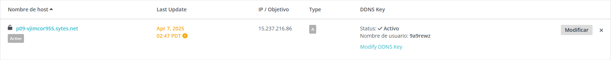
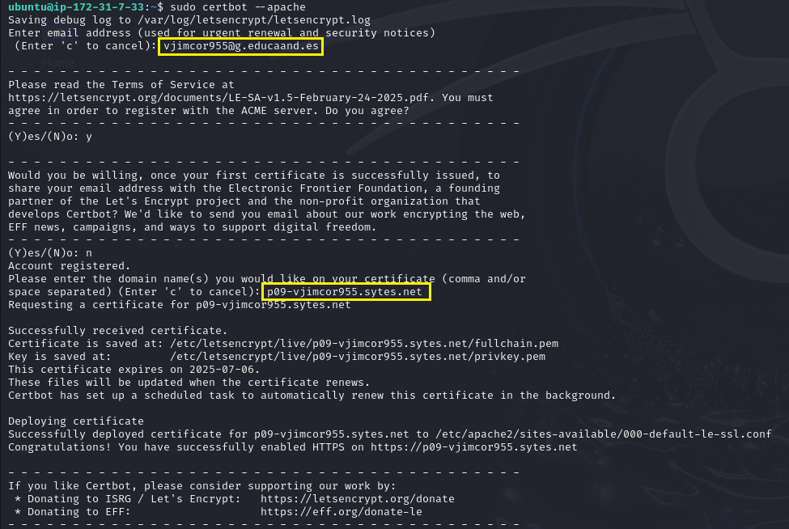
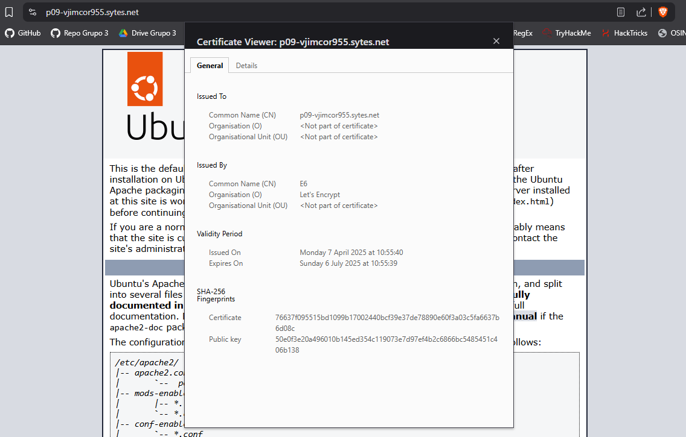
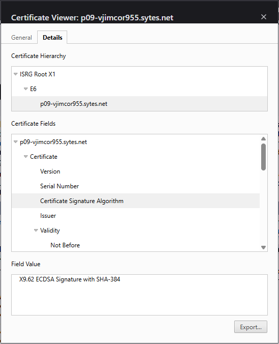
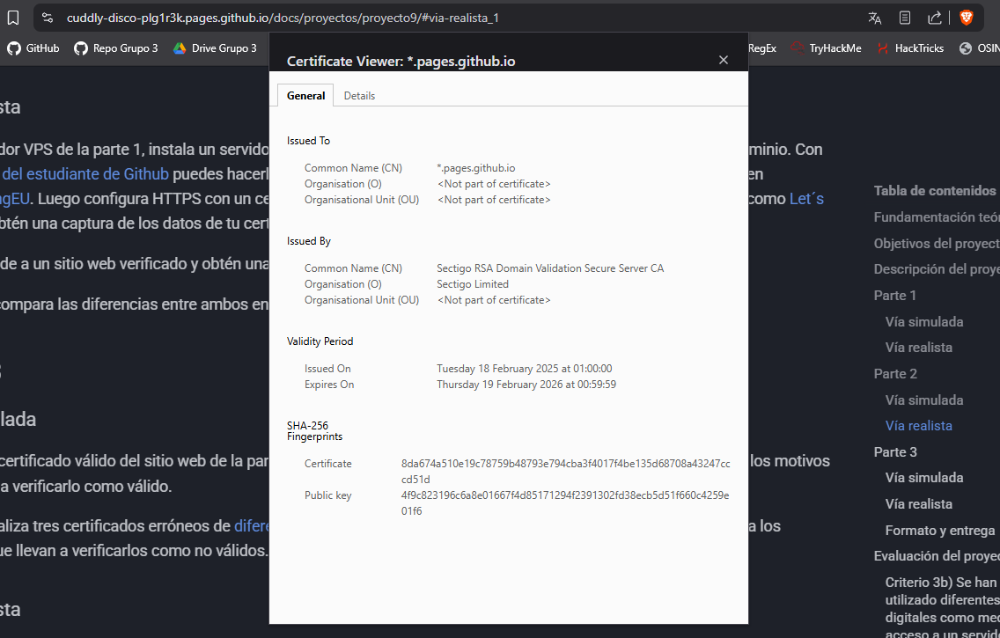
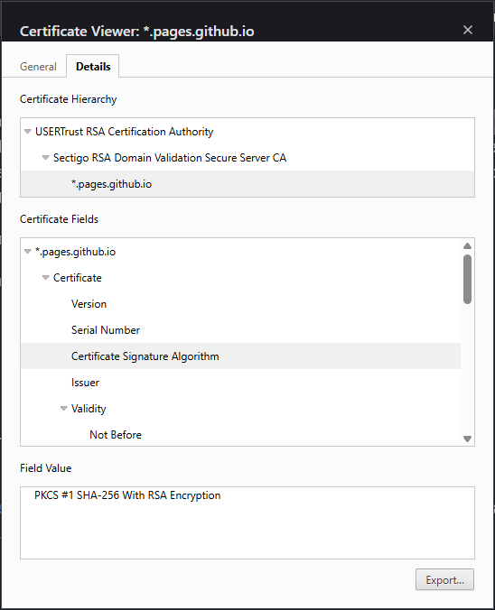

# Proyecto 9: Certificados digitales - Parte 2

## Indice

1. [Servidor web y dominio](#1-servidor-web-y-dominio)
2. [Generar certificado](#2-generar-certificado)
3. [Comparar certificados](#3-comparar-certificados)

## 1. Servidor web y dominio

El servidor web que he elegido es Apache2, estos son los pasos que he seguido:

1. Instalar apache2

   Para instalar apache2 he usado el siguiente comando:

   ```bash
   sudo apt update && sudo apt install apache2 -y
   ```

2. Registrar dominio

   Para el dominio he usado [Noip](https://www.noip.com/es-MX):

   

## 2. Generar certificado

Para generar el certificado he usado la herramienta Let's Encrypt con los siguientes comandos:

```bash
sudo apt install certbot python3-certbot-apache -y
sudo certbot --apache
```



## 3. Comparar certificados

- Certificado [p09-vjimcor955.sytes.net](https://p09-vjimcor955.sytes.net)





- Certificado [pages.github.io](https://cuddly-disco-plg1r3k.pages.github.io/docs/proyectos/proyecto9/#via-realista_1)





En la siguiente tabla se pueden ver las principales diferencias entre ambos certificados:

| Clave                          | p09-vjimcor955.sytes.net                                         | pages.github.io                                                  |
| ------------------------------ | ---------------------------------------------------------------- | ---------------------------------------------------------------- |
| Common Name (CN)               | E6                                                               | Sectigo RSA Domain Validation Secure Server CA                   |
| Organisation (O)               | Let's Encrypt                                                    | Sectigo Limited                                                  |
| Issued On                      | Monday 7 April 2025 at 10:55:40                                  | Tuesday 18 February 2025 at 01:00:00                             |
| Expires                        | Sunday 6 July 2025 at 10:55:39                                   | Thursday 19 February 2026 at 00:59:59                            |
| Certificate                    | 76637f095515bd1099b17002440bcf39e37de78890e60f3a03c5fa6637b6d08c | 8da674a510e19c78759b48793e794cba3f4017f4be135d68708a43247cccd51  |
| Public key                     | 50e0f3e20a496010b145ed354c119073e7d97ef4b2c6866bc5485451c406b138 | 4f9c823196c6a8e01667f4d85171294f2391302fd38ecb5d51f660c4259e01f6 |
| CertificateSignature Algorithm | X9.62 ECDSA Signature with SHA-384                               | PKCS #1 SHA-256 With RSA Encryption                              |

---

Hecho por Víctor Jiménez
