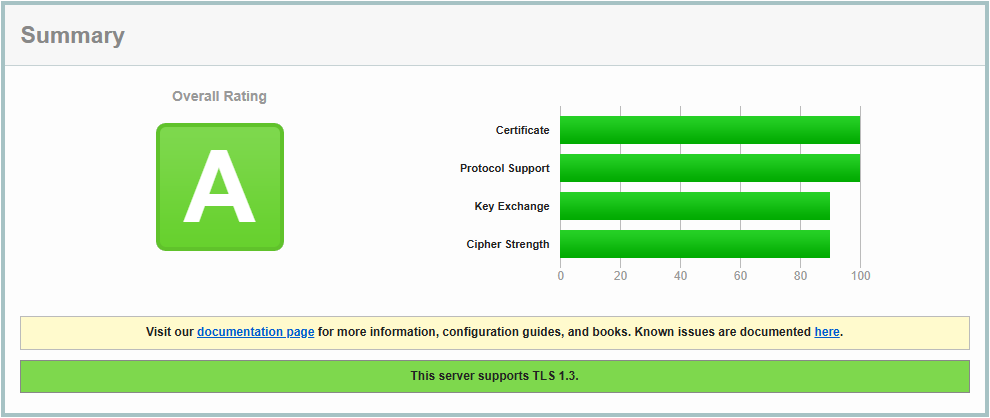
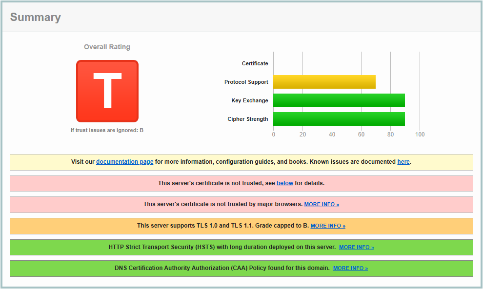
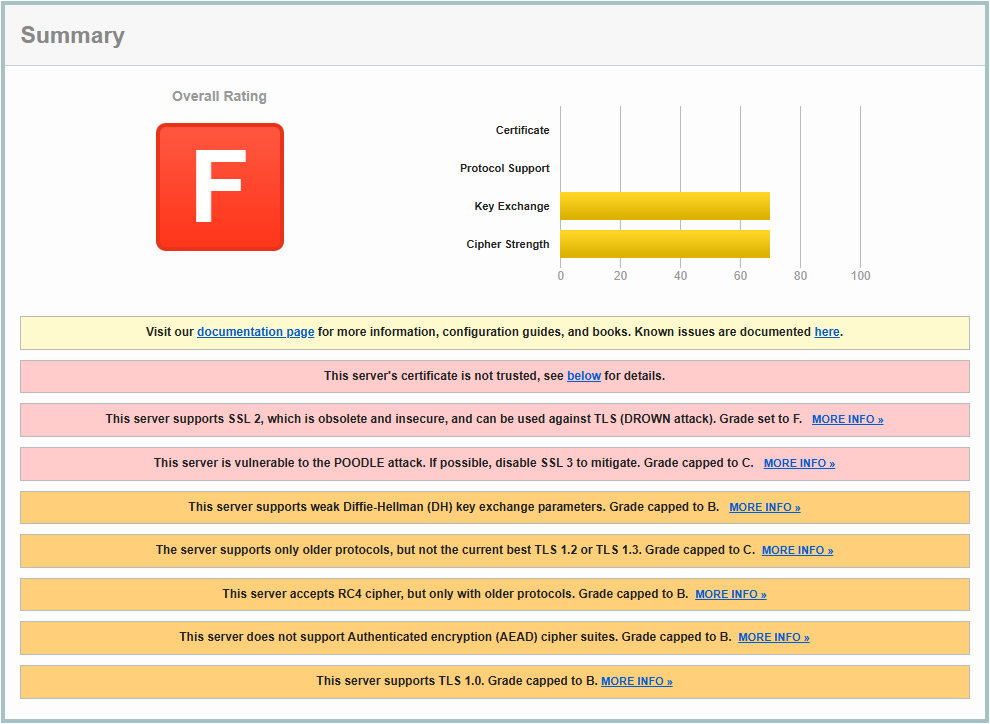
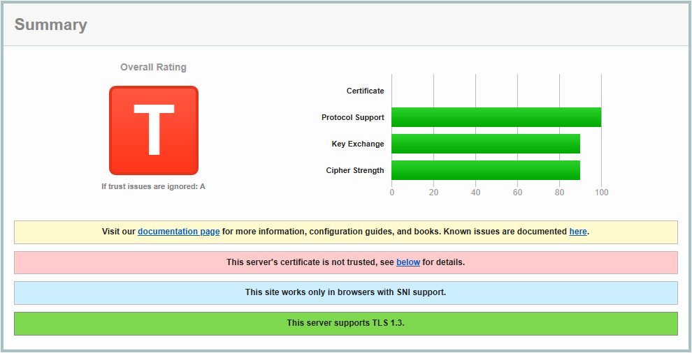

# Proyecto 9: Certificados digitales - Parte 3

## Indice

1. [Análisis del certificado válido](#1-análisis-del-certificado-válido)
2. [Certificados no válidos](#2-certificados-no-válidos)  
   2.1. [cacert.org](#21-cacertorg)  
   2.2. [cabinet.miratel.com.ua](#22-cabinetmiratelcomua)  
   2.3. [codestack.site](#23-codestacksite)

## 1. Análisis del certificado válido

El análisis del certificado de _p09-vjimcor955.sytes.net_ en [SSL Labs](https://www.ssllabs.com/ssltest/) ha dado como resultado que presenta una configuración sólida que cumple con los estándares actuales de seguridad. Se destacan los siguientes puntos:

- La cadena de confianza está completa, ya que el certificado ha sido emitido por una autoridad de certificación reconocida y confiable, sin que se hayan detectado errores en la validación de la cadena de certificación.

- El servidor es compatible con el protocolo TLS 1.3, lo que representa una mejora significativa tanto en en seguridad como rendimiento.

- El certificado utiliza una clave de curva elíptica de 256 bits junto con el algoritmo de firma SHA384withECDSA, ambos considerados como robustos y eficientes garantizando un alto nivel de protección criptográfica.

- El certificado cuenta con un estado de revocación válido, lo que indica que el certificado no ha sido comprometido ni anulado por la entidad emisora.

En conjunto, estos elementos reflejan una implementación de seguridad eficiente que cumple con las mejores prácticas en el uso de certificados digitales.

## 2. Certificados no válidos

Para este apartado he analizado en [SSL Labs](https://www.ssllabs.com/ssltest/) las páginas: _cacert.org_, _cabinet.miratel.com.ua_ y _codestack.site_. Los resultados han sido los siguientes:

### 2.1. cacert.org

El análisis de _cacert.org_ da como resultado que el certificado no es valido para los navegadores principales. El motivo principal es que el certificado ha sido emitido por una autoridad de certificación que no está considerado de confianza por los navegadores, lo que significa que aunque el certificado pueda estar técnicamente bien formado, no se puede verificar su autenticidad.

Aunque no afecte directamente a la validez del certificado, el servidor permite el uso de los protocolos TLS 1.0 y TLS 1.1, los cuales están obsoletos y presentan vulnerabilidades conocidas.

### 2.2. cabinet.miratel.com.ua

El análisis de _cabinet.miratel.com.ua_ concluye que el servidor presenta múltiples problemas críticos que comprometen gravemente su seguridad. Entre los que destacan:

- El certificado no es confiable para los navegadores debido a que no ha sido emitido por una autoridad de certificación reconocida.

- Soporte para versiones obsoletas e inseguras como SSL 2 y SSL 3, las cuales son vulnerables a ataques como DROWN y POODLE.

- Uso de algoritmos criptográficos débiles, como el cifrado RC4 y parámetros de intercambio de claves Diffie-Hellman.

- Ausencia de cifrado autenticado, lo que expone la comunicación a posibles manipulaciones.

- Falta de soporte para los protocolos modernos y seguros TLS 1.2 y TLS 1.3.

### 2.3. codestack.site

El análisis de _codestack.site_ demuestra una configuración sólida en seguridad criptográfica, ya que ofrece soporte para el protocolo TLS 1.3 y emplea algoritmos modernos y seguros.

A pesar de que los aspectos técnicos cumplen con los estándares actuales, el certificado se muestra como no valido debido a la falta de confianza en la entidad emisora, lo que impide establecer una conexión segura con validación completa por parte del navegador.

---

Hecho por Víctor Jiménez
